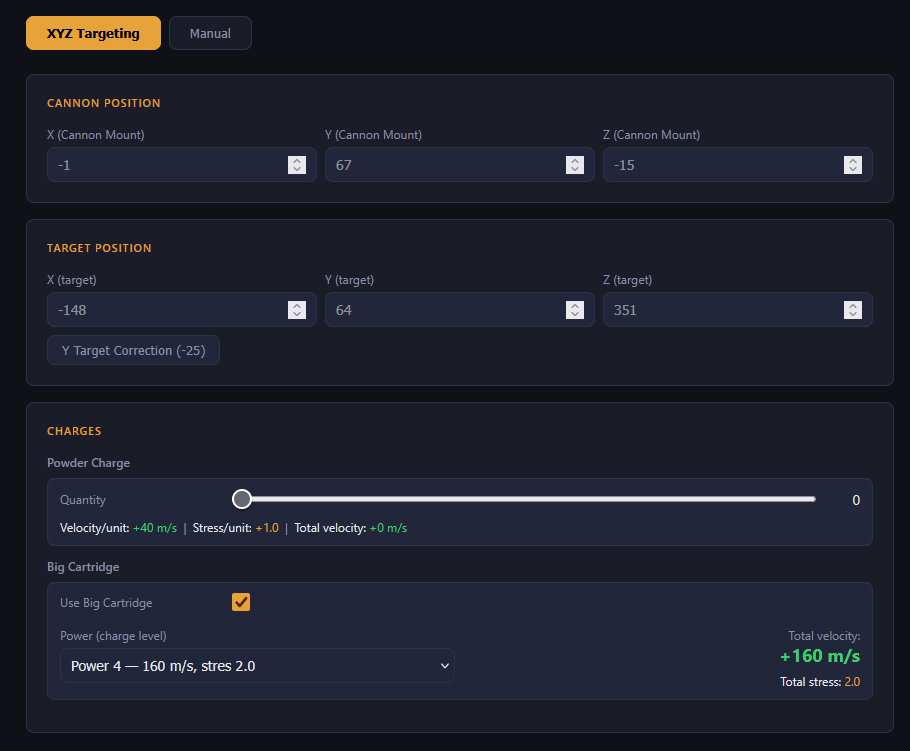
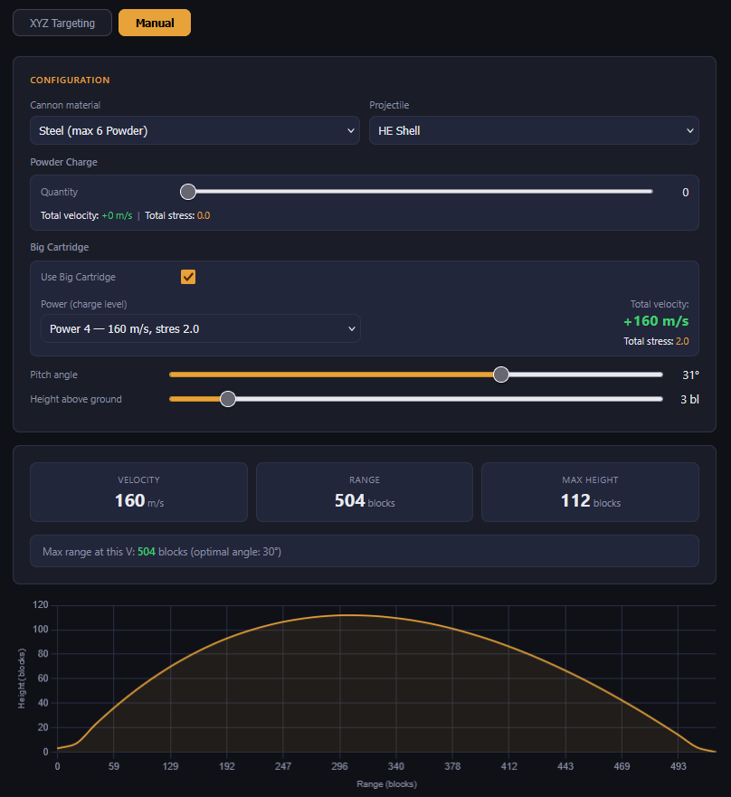

# CBC Ballistic Calculator

A ballistic calculator for the **Create Big Cannons** Minecraft mod (v5.11.3).
Available in Polish and English.

## Table of Contents

- [Features](#features)
- [Screenshots](#screenshots)
- [Physics](#physics)
- [Usage](#usage)
  - [XYZ Mode](#xyz-mode)
  - [Manual Mode](#manual-mode)
- [File Structure](#file-structure)
- [Known Issues](#known-issues)
- [Contributing](#contributing)
- [Credits](#credits)
- [License](#license)

## Features

- **XYZ targeting mode** — enter Cannon Mount and target coordinates (F3), instantly get yaw and pitch
- **Manual mode** — simulate trajectory and range for any cannon configuration
- Big Cartridge with power levels 1–4 and stress display
- Y correction button (−25 blocks) to reduce ricochet risk
- Warnings for cannon jamming, ricochet risk, and Mortar Stone speed limit
- Maximum range display for current velocity
- Trajectory chart (parabola visualization)
- PL / EN language toggle

## Screenshots

**XYZ Targeting Mode**


**Manual Mode**


## Physics

Based on formulas by **sashafiesta** from the [CBC Discord](https://discord.gg/vgfMMUUgvT), calibrated with in-game empirical measurements on CBC 5.11.3.

| Constant | Value |
|---|---|
| Air drag | 0.99 per tick |
| Gravity | 0.05 blocks/tick² |
| Yaw 0° | South (+Z), increases toward West |

Velocity formula: `V = (powder × 40 + cartridge_vel) / 20` [blocks/tick]

## Usage

Open `index.html` in any browser. No installation required.

Or use the live version on [GitHub Pages](https://kbedn455.github.io/cbc-calculator).

### XYZ Mode

1. Stand at the **Cannon Mount** block, press F3, note X Y Z
2. Look at the target block, press F3, note X Y Z
3. Enter both positions and your charge configuration
4. Set the displayed **Yaw** and **Pitch** on your cannon
5. Use **Y correction (−25)** if ricochet warning appears

### Manual Mode

Select material, projectile, charges, pitch and cannon height to preview the trajectory. Cannon height is based on the height of a cannon parts above the ground.

## File Structure

```
cbc-calculator/
├── index.html          # Main HTML
├── css/
│   └── style.css       # All styles
├── js/
│   ├── i18n.js         # Translations (PL / EN)
│   ├── physics.js      # Ballistic calculations
│   └── ui.js           # UI logic and chart
├── screenshots/
│   ├── xyz-mode.png    # Screenshot — XYZ mode
│   └── manual-mode.png # Screenshot — Manual mode
├── .gitignore
├── CHANGELOG.md
├── LICENSE             # GNU GPL v3
└── README.md
```

## Known Issues

- Pitch below 15° causes ricochet — use Y correction (−25) or reduce charge count
- Yaw and pitch accept whole degrees only — fractional angles not supported by current Cannon Mount
- Calculator accuracy may vary on terrain with significant height differences

## Contributing

Contributions are welcome. If you want to improve the calculator:

1. Fork the repository
2. Create a new branch (`git checkout -b feature/your-feature`)
3. Commit your changes (`git commit -m 'Add some feature'`)
4. Push to the branch (`git push origin feature/your-feature`)
5. Open a Pull Request

If you find a bug or have a suggestion, open an [Issue](../../issues).

Please keep the code style consistent and test any physics changes with in-game measurements before submitting.

## Credits

- **sashafiesta** — original ballistic formulas and principles (CBC Discord #showcase)
- **Malex21** — reference Python implementation ([CreateBigCannons-BallisticCalculator](https://github.com/Malex21/CreateBigCannons-BallisticCalculator))
- **kbedn455** — JavaScript/web implementation, empirical calibration, UI

## License

This project is licensed under the **GNU General Public License v3.0** — see [LICENSE](LICENSE) for details.

This program is free software: you can redistribute it and/or modify it under the terms of the GNU General Public License as published by the Free Software Foundation, either version 3 of the License, or (at your option) any later version.
